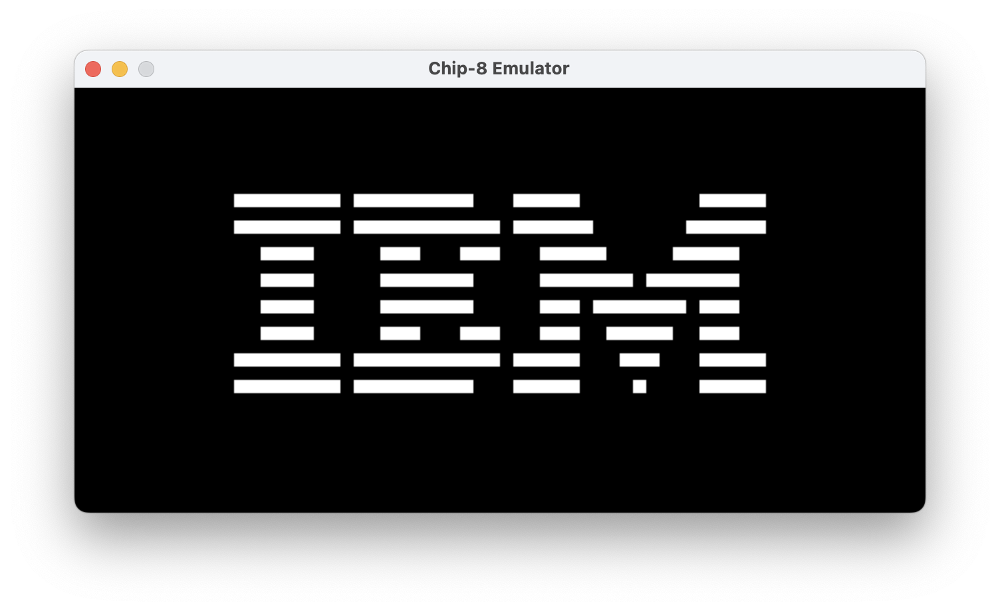
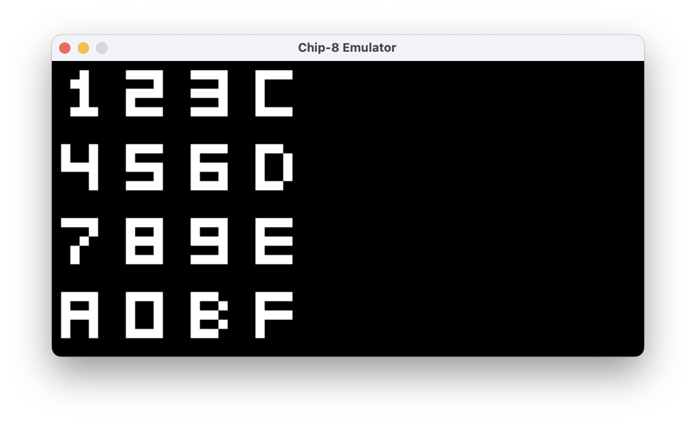
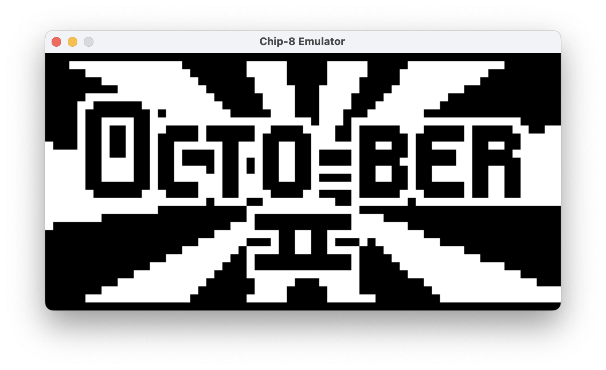
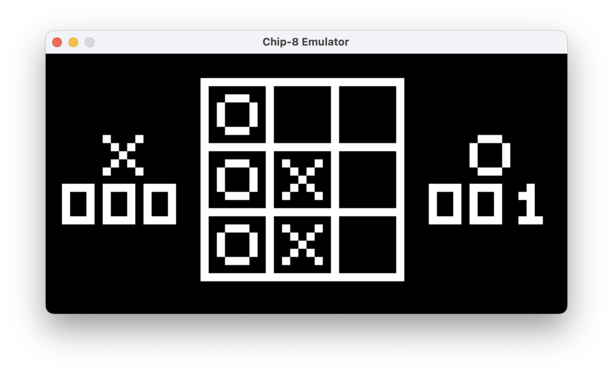

# CHIP-8 Emulator
Welcome to the CHIP-8 Emulator project! This repository contains an implementation of a CHIP-8 emulator written in Go.

## What is CHIP-8?
CHIP-8 is an interpreted programming language developed by Joseph Weisbecker in the mid-1970s. It was originally used on microcomputers like the COSMAC VIP and Telmac 1800, designed to simplify game development on these systems.

## Features
- Complete emulation of all CHIP-8 instructions.
- Support for graphics and input as per the CHIP-8 specification.

## Project Structure
The project is organized as follows:
- **cmd/chip8**: Contains the main application code to run the emulator.
- **internal/emulator**: Houses the core implementation of the CHIP-8 emulator.
- **roms**: Directory for storing CHIP-8 ROM files that can be executed by the emulator.
- **sounds**: Directory for storing sound effects
- **screenshots**: Directory for storing screenshot images

## System Requirements
- Go version 1.16 or newer.
- SDL2 for graphics support.

## Opcode Implementation Status

The following table lists all CHIP-8 opcodes and their implementation status in this emulator:

| Opcode | Instruction                           | Status |
|--------|---------------------------------------|--------|
| 0x00E0 | Clear the display                     |    ✅   |
| 0x00EE | Return from a subroutine              |    ✅   |
| 0x1NNN | Jump to address NNN                   |    ✅   |
| 0x2NNN | Call subroutine at NNN                |    ✅   |
| 0x3XNN | Skip next instruction if Vx = NN      |    ✅   |
| 0x4XNN | Skip next instruction if Vx ≠ NN      |    ✅   |
| 0x5XY0 | Skip next instruction if Vx = Vy      |    ✅   |
| 0x6XNN | Set Vx = NN                           |    ✅   |
| 0x7XNN | Set Vx = Vx + NN                      |    ✅   |
| 0x8XY0 | Set Vx = Vy                           |    ✅   |
| 0x8XY1 | Set Vx = Vx OR Vy                     |    ✅   |
| 0x8XY2 | Set Vx = Vx AND Vy                    |    ✅   |
| 0x8XY3 | Set Vx = Vx XOR Vy                    |    ✅   |
| 0x8XY4 | Set Vx = Vx + Vy, set VF = carry      |    ✅   |
| 0x8XY5 | Set Vx = Vx - Vy, set VF = NOT borrow |    ✅   |
| 0x8XY6 | Set Vx = Vx SHR 1                     |    ✅   |
| 0x8XY7 | Set Vx = Vy - Vx, set VF = NOT borrow |    ✅   |
| 0x8XYE | Set Vx = Vx SHL 1                     |    ✅   |
| 0x9XY0 | Skip next instruction if Vx ≠ Vy      |    ✅   |
| 0xANNN | Set I = NNN                           |    ✅   |
| 0xBNNN | Jump to address NNN + V0              |    ✅   |
| 0xCXNN | Set Vx = random byte AND NN           |    ✅   |
| 0xDXYN | Display n-byte sprite starting at memory location I at (Vx, Vy), set VF = collision |   ✅    |
| 0xEX9E | Skip next instruction if key with the value of Vx is pressed |   ✅    |
| 0xEXA1 | Skip next instruction if key with the value of Vx is not pressed |   ✅    |
| 0xFX07 | Set Vx = delay timer value            |   ✅    |
| 0xFX0A | Wait for a key press, store the value of the key in Vx |   ✅    |
| 0xFX15 | Set delay timer = Vx                  |   ✅    |
| 0xFX18 | Set sound timer = Vx                  |   ✅    |
| 0xFX1E | Set I = I + Vx                        |   ✅    |
| 0xFX29 | Set I = location of sprite for digit Vx |   ✅    |
| 0xFX33 | Store BCD representation of Vx in memory locations I, I+1, and I+2 |   ✅    |
| 0xFX55 | Store registers V0 through Vx in memory starting at location I |   ✅    |
| 0xFX65 | Read registers V0 through Vx from memory starting at location I |   ✅    |

## Screenshots

## Contributing
Contributions are welcome! If you find any bugs or have suggestions for improvements, please open an issue or submit a pull request.

## License
This project is licensed under the [MIT License](LICENSE). See the LICENSE file for more details.